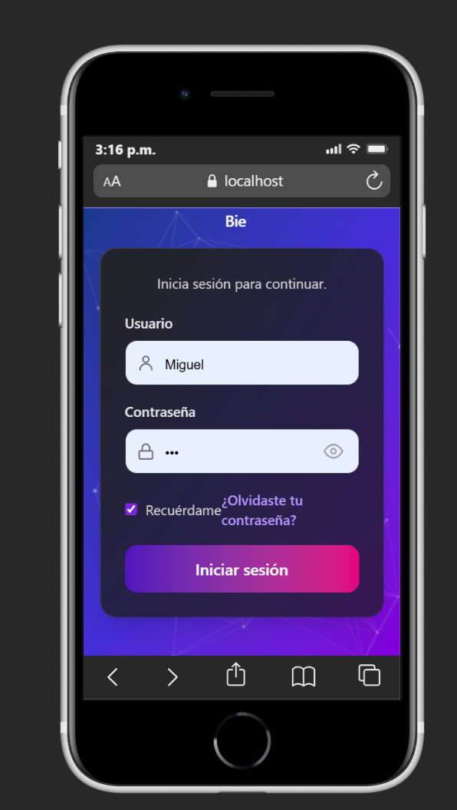
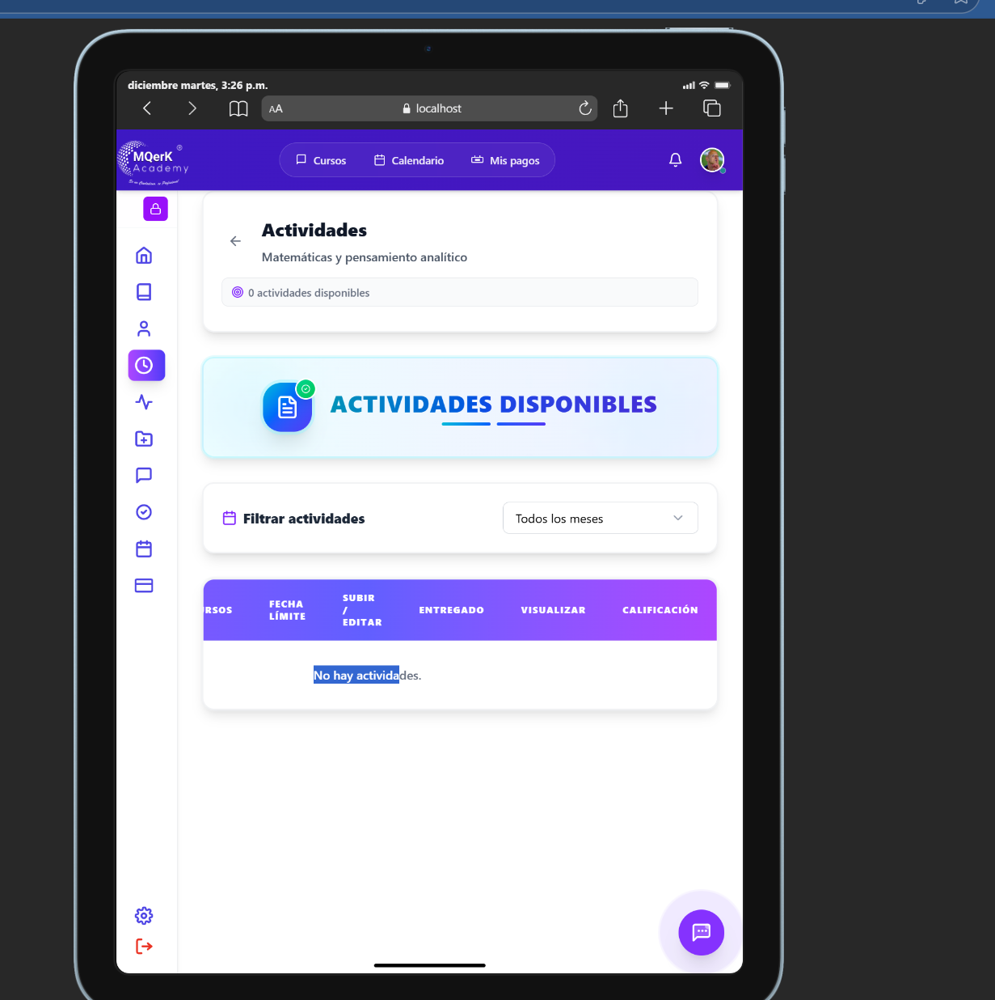
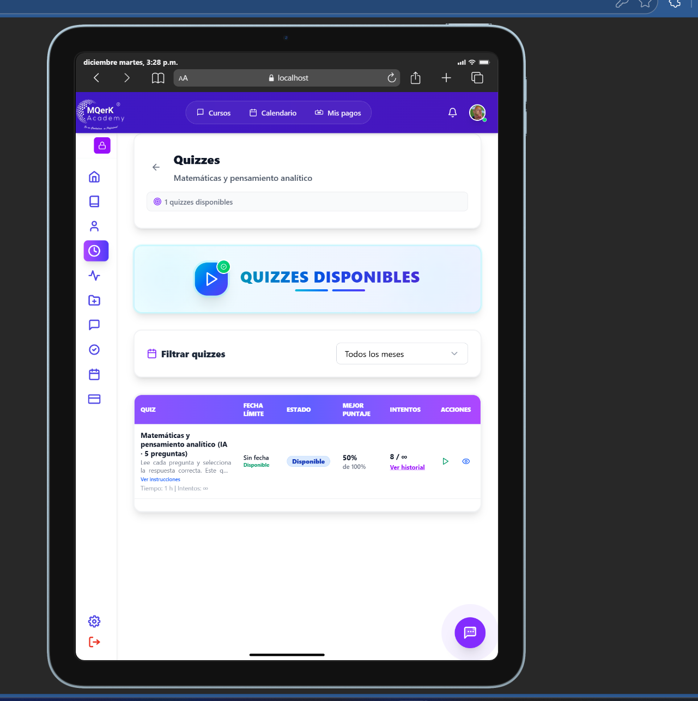
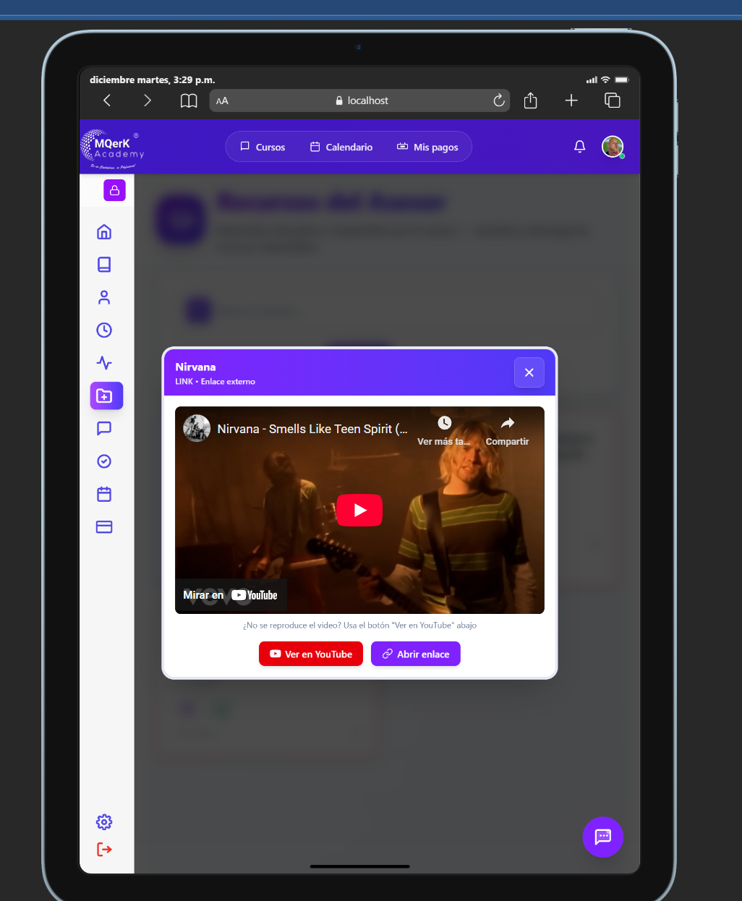
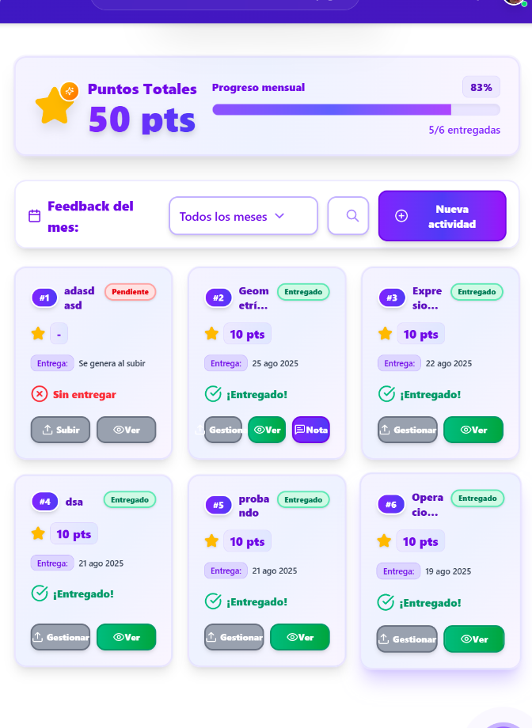
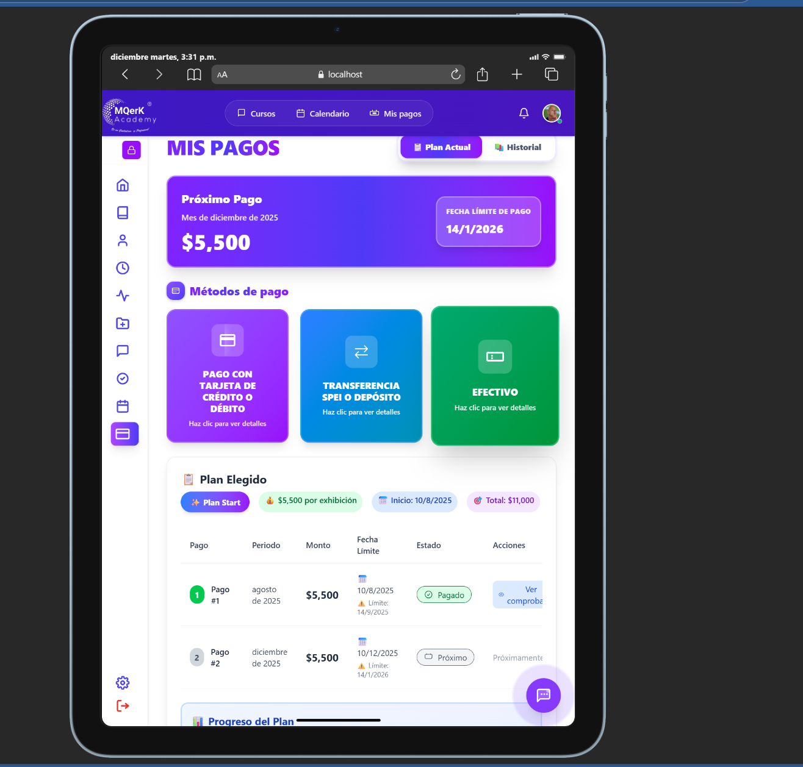

========================================AJUSTES POR REALIZAR=================================

###################################################### PANEL DEL ALUMNO ######################################################
el chat no es responsivo en móviles, sobre todo en móviles con pantallas chicas como el IPhone SE, probar con otros taños y ajustar ese detalle

AJUSTA EN SIMULACIONES LA SECCION DE ANALISIS YA QUE LOS BOTONES RECIEN AÑADIDOS NO SE AJUSTAN A TODAS LAS PANTALLAS:

EL CONTADOR DE USO

EL BOTON DE GENERAR ANASIS ESTA ALGO GRANDE

EL TITLO DE ANASIS, PORNERLO COMO TITULO DE ESE CONTENEDOR

la configuración, tratar de poner en diferentes disposiciones los elementos en móviles de pantallas chicas, ya que actualmente no se ve bien, tal vez usar tabs, o alguna barra

el login, el "olvidé contarseña esta un poco pegado en la opción de recordar"

ver si la función de recordar el usuario sirve o no porque no veo que funcione

POR ULTIMO, VER EN LA SECCIONES DE SIMUALCIONES Y QUIZZES SI SE USARA LA FORMA VISUAL EN FORMA DE TABLAS O CARTAS, YA QUE EN LA SECCION DE ACTIVIDADES SE USO LA FORMA DE TABLAS Y EN QUIZZES 
SE USAN CARTAS

NOTA: LA SECCION DE GRAFICAS ESTA PENDIENTE, EL DISEÑO AUN NO LO DETERMINO Y MENOS SE AJUSTA PARA VARIOS DISPOSITIVOS

FALTA BAJAR UN POCO LOS ELEMENTOS DE LA SECCION DE ACTIVIDADES, EN MOVILE
  REFERENCIA 

LO MISMO EN LA SECCION DE QUIZZES

  

  LO MISMO EN LA SECCION DE SIMULACIONES  GENERALES
   Y SIMULACIONES ESPECIFICAS

   EN RECURSOS MOVER LAS MODALES UN POCO HACIA LA DERECHA, ESTA UN POCO A LA IZQUIERDA ESTO EN IPAD 

   

   EN FEEDBACK  LAS TARJETAS, LOS BOTOONS Y LETRAS ALGUNAS ETSAN FUERA DE ORDEN

   

   DE IGUAL FORMA BAJAR LOS ELEMENTOS EN LA SECCION DE MIS PAGOS 

   

   AHI MISMO REVISAR QUE PASA CON LO S PAGOS PENDIENTES POEQUE MI USUARIO TIENE UNO Y NO PASA NADA SEGUN SE DBERIA BLOQUEAR

   ¡Perfecto! Entiendo completamente tu sistema. Déjame resumir lo que me estás explicando:

🤖 Sistema Actual con APIs de Gemini
📚 Uso de Gemini AI en tu plataforma:
1. Lado del Asesor (Creación de contenido):

✅ Crear quizzes automáticamente
✅ Generar simulaciones de exámenes
✅ Crear fórmulas para las actividades
2. Lado del Estudiante (Análisis y ayuda):

✅ Análisis de quizzes completados
✅ Análisis de simulaciones de exámenes
✅ Obtener retroalimentación y ayuda personalizada
💡 ¿Qué quieres hacer ahora?
Veo que tienes un sistema bastante completo con Gemini. ¿Cuál es tu objetivo específico? ¿Quieres:

Optimizar el uso de las APIs de Gemini para reducir costos o mejorar rendimiento?
Agregar nuevas funcionalidades con Gemini (por ejemplo, tutorías personalizadas, generación de explicaciones)?
Mejorar el análisis que se le da a los estudiantes?
Implementar un sistema de caché para evitar llamadas repetidas a Gemini?
Agregar límites de uso por estudiante o asesor?
Crear un dashboard para monitorear el uso de las APIs?
Algo más específico que tengas en mente?
Por favor, cuéntame más sobre lo que quieres lograr y te ayudo a implementarlo. 🚀

gregar límites de uso por estudiante o asesor? segun yo ya tiene un sistema de usso para ambos no se so este bien implementado 

Optimizar el uso de las APIs de Gemini para reducir costos o mejorar rendimiento? si tambien me intresa eso 

otra cosa que uiero es que no solo permits usar apis de gemin sino tambien de groq puedes chcar de aqui mas sobre esto https://console.groq.com/docs/overview

========================================IMPLEMENTACIONES COMPLETADAS=================================

✅ SISTEMA DE LÍMITES DE USO IMPLEMENTADO
- Modelo y servicio para gestionar límites desde la base de datos (server/models/ai_quota.model.js)
- Middleware de verificación de límites (server/middlewares/aiUsageControl.js)
- Límites por rol (estudiante, asesor, admin) configurados en ai_quota_config
- Límites diarios y mensuales tanto por usuario como globales
- Registro automático de cada uso en ai_usage_log

✅ SOPORTE PARA GROQ API IMPLEMENTADO
- Controlador de Groq (server/controllers/groq.controller.js)
- Rutas de Groq (server/routes/groq.routes.js)
- Servicio del cliente para Groq (client/src/service/groqService.js)
- Integrado en app.js

✅ SERVICIO UNIFICADO DE IA
- Servicio unificado backend (server/services/unifiedAI.service.js)
- Servicio unificado frontend (client/src/service/unifiedAIService.js)
- Permite elegir entre Gemini y Groq
- Sistema de fallback automático

✅ OPTIMIZACIONES IMPLEMENTADAS
- Sistema de caché mejorado (6 horas TTL, configurable)
- Rotación automática de API keys para evitar rate limits
- Sistema de cooldown inteligente
- Logging detallado de cada uso (proveedor, modelo, tokens, duración)
- Rate limiting local en el cliente

✅ MIGRACIÓN DE BASE DE DATOS
- Migración SQL para agregar campo 'proveedor' a ai_usage_log (server/migrations/009_add_proveedor_to_ai_usage_log.sql)
- Compatibilidad con tablas existentes (verifica si el campo existe antes de usarlo)

📝 DOCUMENTACIÓN
- Guía completa de configuración (docs/ai-providers-setup.md)
- Instrucciones para obtener API keys de Gemini y Groq
- Ejemplos de uso en backend y frontend

🔧 CONFIGURACIÓN NECESARIA
1. Agregar variables de entorno en server/.env:
   - GROQ_API_KEY=tu_api_key_groq
   - GROQ_API_KEY_QUIZZES_1, GROQ_API_KEY_ANALISIS_1, etc. (opcional, por propósito)

2. Ejecutar migración SQL:
   - server/migrations/009_add_proveedor_to_ai_usage_log.sql

3. Reiniciar el servidor después de agregar las variables de entorno

💡 PRÓXIMOS PASOS SUGERIDOS
- [ ] Crear dashboard de monitoreo de uso de IA
- [ ] Agregar notificaciones cuando se alcanza 80% del límite
- [ ] Panel de administración para configurar límites
- [ ] Análisis de costos por proveedor
- [ ] Selección automática inteligente de proveedor según tipo de tarea

## Componentes Duplicados Similares para Diferentes Roles

### **1. Sidebars (Barras laterales)**
- [`SideBar_Alumno_Comp.jsx`](client/src/components/layouts/SideBar_Alumno_Comp.jsx) - Para alumnos
- [`SideBarAdmin.jsx`](client/src/components/layouts/SideBarAdmin.jsx) - Para administradores  
- [`SideBarAsesor.jsx`](client/src/components/layouts/SideBarAsesor.jsx) - Para asesores

**Problema**: Misma funcionalidad (navegación, colapsado, responsive) pero con menús diferentes. Podría ser un componente configurable.

### **2. Layouts (Estructuras de página)**
- [`AlumnoLayout.jsx`](client/src/components/layouts/AlumnoLayout.jsx) - Layout para alumnos
- [`AdminLayout.jsx`](client/src/components/layouts/AdminLayout.jsx) - Layout para administradores
- [`Layout.jsx`](client/src/components/layouts/Layout.jsx) - Layout general

**Problema**: Estructura similar (Header + Sidebar + Contenido) pero con componentes específicos.

### **3. Dashboards (Paneles de inicio)**
- [`InicioAlumnoDashboard.jsx`](client/src/components/student/InicioAlumnoDashboard.jsx) - Dashboard alumno
- [`inicio-admin.jsx`](client/src/components/admin/inicio-admin.jsx) - Dashboard admin
- [`AsesorMaestro.jsx`](client/src/components/Asesor/AsesorMaestro.jsx) - Dashboard asesor

**Problema**: Muestra métricas y resúmenes similares pero con datos específicos por rol.

### **4. Componentes de Configuración**
- [`Configuracion_Alumno_Comp.jsx`](client/src/components/student/Configuracion_Alumno_Comp.jsx) - Config alumno
- [`Configuracion_Admin_comp.jsx`](client/src/components/admin/Configuracion_Admin_comp.jsx) - Config admin
- [`Configuraciones.jsx`](client/src/components/Asesor/Configuraciones.jsx) - Config asesor

**Problema**: Formularios de configuración de perfil con lógica similar.

### **5. Componentes de Actividades/Quizzes**
- [`Actividades_Alumno_comp.jsx`](client/src/components/student/Actividades_Alumno_comp.jsx) - Actividades alumno
- [`Actividades.jsx`](client/src/pages/Asesor/Actividades.jsx) - Actividades asesor

**Problema**: Vista y gestión de actividades con diferencias mínimas de permisos.

### **6. Componentes de Calendario**
- [`Calendar_Alumno_Comp.jsx`](client/src/components/student/Calendar_Alumno_Comp.jsx) - Calendario alumno
- [`Calendario_Admin_comp.jsx`](client/src/components/admin/Calendario_Admin_comp.jsx) - Calendario admin

**Problema**: Mismo componente de calendario con diferentes fuentes de datos.

### **7. Componentes de Feedback**
- [`Feedback_Alumno_Comp.jsx`](client/src/components/student/Feedback_Alumno_Comp.jsx) - Feedback alumno
- [`Feedback.jsx`](client/src/pages/Asesor/Feedback.jsx) - Feedback asesor

**Problema**: Sistema de retroalimentación con lógica similar.

### **8. Headers (Encabezados)**
- [`Header_Alumno_comp.jsx`](client/src/components/layouts/Header_Alumno_comp.jsx) - Header alumno
- [`HeaderAdmin.jsx`](client/src/components/layouts/HeaderAdmin.jsx) - Header admin

**Problema**: Barra superior con búsqueda, notificaciones y perfil.

### **Patrón de Duplicación Identificado**
Cada rol tiene su propia versión de componentes con:
- **Misma estructura HTML/CSS**
- **Misma lógica de estado y efectos**
- **Diferentes permisos y datos**
- **Diferentes rutas de API**

### **Solución Propuesta**
1. **Componentes Parametrizados**: Crear componentes base con props para personalizar por rol
2. **HOCs (Higher-Order Components)**: Envolver componentes base con lógica específica
3. **Render Props**: Pasar funciones de renderizado condicional
4. **Contextos de Rol**: Usar contexto para determinar permisos y mostrar/ocultar elementos

**Ejemplo**: Un único `SideBar` que reciba `menuItems` y `userRole` como props, en lugar de tres componentes separados.